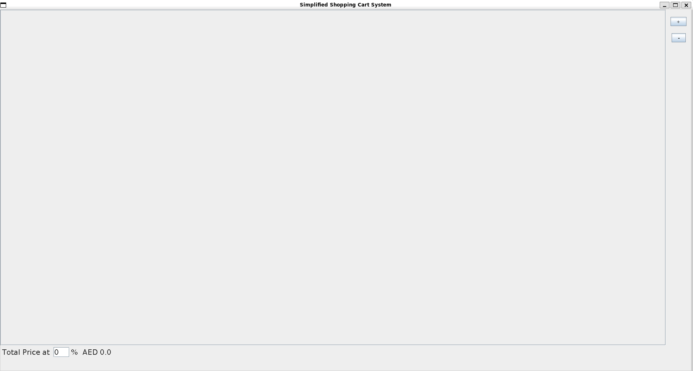
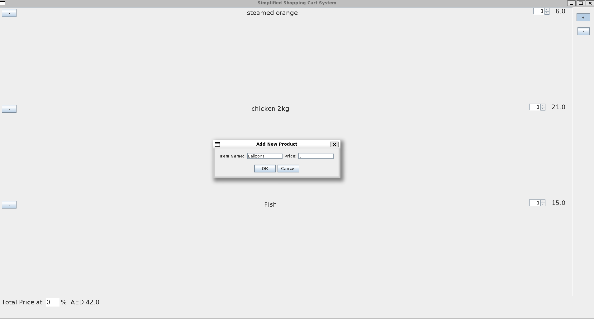
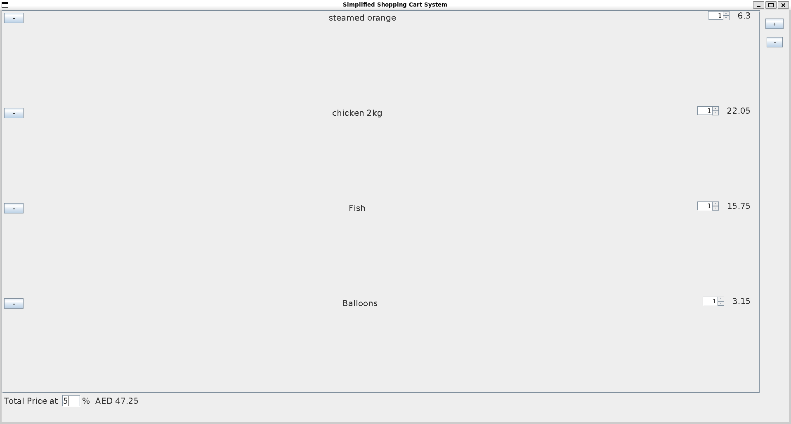

# 🛒 StoreGUI

A simple Java Swing application that simulates a basic shopping cart system with a graphical user interface.

This project demonstrates object-oriented programming principles and GUI development using Java Swing. Users can add items, modify quantities, remove products, apply tax, and calculate a final total.

---

## 📸 Application Preview

### 🏠 Main Window

  

---

### ➕ Adding an Item

  

---

### 🧾 Cart with Tax Applied

  

---

## 📌 Features

- Add products with name and price  
- Adjust product quantities using spinners  
- Remove products from the cart  
- Apply a custom tax rate  
- Automatically calculate total cost including tax  
- Scrollable product list interface  
- Built using Java Swing  

---

## 🧱 Project Structure

    StoreGUI/
    │
    ├── MAIN.java
    ├── MyFrame.java
    ├── images/
    │   ├── main-window.png
    │   ├── add-item.png
    │   └── cart-with-tax.png
    └── README.md

---

## 🛠 Possible Improvements

- Save cart data between sessions
- Improve UI styling and layout
- Add product categories
- Implement discount codes
- Add input validation and error handling
- Convert to JavaFX for a modern interface